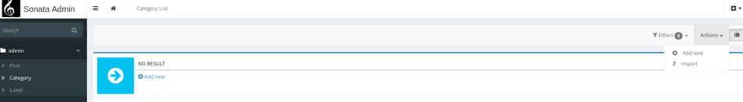
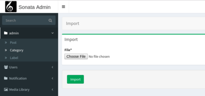

SonataImporterBundle
====================

Easier handling of Import in Sonata Admin.

Built on top of [Importer](https://github.com/kunicmarko20/importer).

[](https://img.shields.io/badge/php-%5E7.1-blue.svg)
[](https://packagist.org/packages/kunicmarko/sonata-importer-bundle)
[](https://packagist.org/packages/kunicmarko/sonata-importer-bundle)

[](https://travis-ci.org/kunicmarko20/SonataImporterBundle)
[](https://coveralls.io/github/kunicmarko20/SonataImporterBundle?branch=master)






Documentation
-------------

* [Installation](#installation)
* [Configuration](#configuration)
* [How to use](#how-to-use)
    * [Prepare Admin Class](#prepare-admin-class)
    * [Prepare Controller](#prepare-controller)
        * [Custom Controler](#custom-controller)
    * [Autoconfigure ImportConfiguration](#autoconfigure-importconfiguration)

## Installation

Because Symfony Flex auto-detects and then registers bundles on its own, you first need to install `kunicmarko/importer`,
add it to `bundles.php`, and then do the same thing for `kunicmarko/sonata-importer-bundle`.

**1.** Install kunicmarko/importer

First you need to install `kunicmarko/importer`, and register the bundle by following [this](https://github.com/kunicmarko20/importer#installation) guide.

**2.**  Add dependency with composer

```bash
composer require kunicmarko/sonata-importer-bundle
```

**3.** Register the bundle in your Kernel

```php
return [
    //...
    KunicMarko\SonataImporterBundle\SonataImporterBundle::class => ['all' => true],
];
```

## Configuration

Currently, you can only change the template files used in bundle, default config looks like:

```yaml
# config/packages/sonata_importer.yaml
sonata_importer:
    templates:
        form:                 '@SonataImporter/form.html.twig'
        action_button:        '@SonataImporter/action_button.html.twig'
        dashboard_action:     '@SonataImporter/dashboard_action.html.twig'
```

## How to use

If you haven't already go and read [Importer documentation](https://github.com/kunicmarko20/importer#how-to-use).
I will assume you are already familiar with ImportConfiguration and I will just explain what is different in
this bundle.

### Prepare Admin Class

Your Admin class has to implement `KunicMarko\SonataImporterBundle\Admin\AdminWithImport`.

### Prepare Controller

By default if you don't set Controller in your Admin service definition we will replace it
with instance of `KunicMarko\SonataImporterBundle\Controller\ImportCRUDController`.

#### Custom Controller

If you are using your own custom controller make sure it implements `KunicMarko\SonataImporterBundle\Controller\ControllerWithImport`,
also you will have to add `KunicMarko\SonataImporterBundle\Controller\ImportActionTrait`
trait to your controller.

### AutoConfigure ImportConfiguration

To be able to auto-configure your ImportConfiguration they will have to implement
`KunicMarko\SonataImporterBundle\SonataImportConfiguration` and configure `format` and `adminClass` methods
along with other methods.

That will look like:

```php
class CategoryCSVImportConfiguration implements SonataImportConfiguration
{
    /**
     * @var EntityManagerInterface
     */
    private $entityManager;

    public function __construct(EntityManagerInterface $entityManager)
    {
        $this->entityManager = $entityManager;
    }

    public static function adminClass(): string
    {
        return CategoryAdmin::class;
    }

    public static function format(): string
    {
        return 'csv';
    }

    public function map(array $item, array $additionalData)
    {
        $category = new Category();

        $category->setName($item[0]);

        $this->entityManager->persist($category);
    }

    public function save(array $items, array $additionalData): void
    {
        $this->entityManager->flush();
    }
}
```
